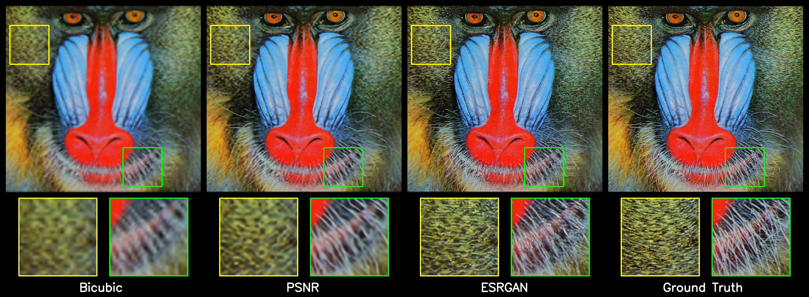
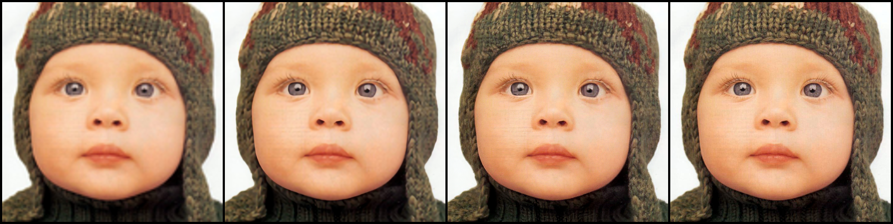
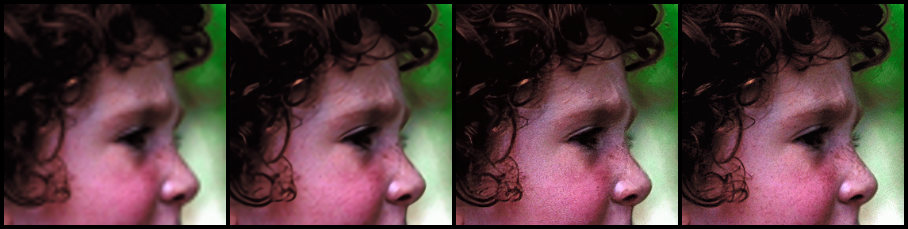
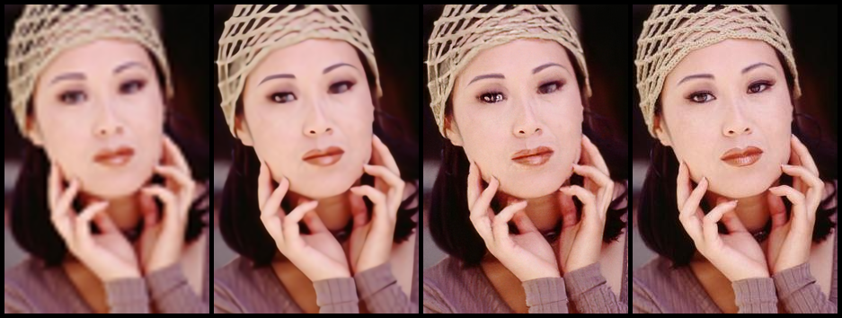
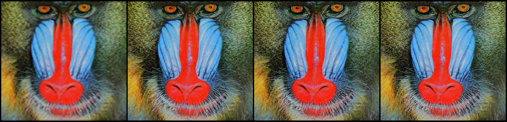
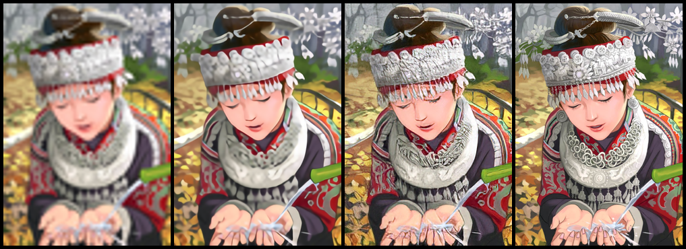
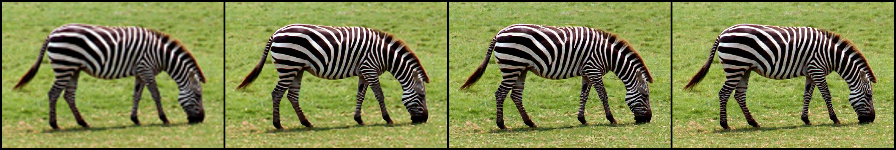

# [esrgan-tf2](https://github.com/peteryuX/esrgan-tf2)

:fire: ESRGAN (Enhanced Super-Resolution Generative Adversarial Networks, published in ECCV 2018) implemented in Tensorflow 2.0+. This is an unofficial implementation. :fire:

[](https://colab.research.google.com/github/peteryuX/esrgan-tf2/blob/master/notebooks/colab-github-demo.ipynb)


Original Paper: &nbsp; [Arxiv](https://arxiv.org/abs/1809.00219) &nbsp; [ECCV2018](http://openaccess.thecvf.com/content_eccv_2018_workshops/w25/html/Wang_ESRGAN_Enhanced_Super-Resolution_Generative_Adversarial_Networks_ECCVW_2018_paper.html)

Offical Implementation: &nbsp; [PyTorch](https://github.com/open-mmlab/mmsr)

:: Results from this reporepository. ::


****

## Contents
:bookmark_tabs:

* [Installation](#Installation)
* [Data Preparing](#Data-Preparing)
* [Training and Testing](#Training-and-Testing)
* [Benchmark and Visualization](#Benchmark-and-Visualization)
* [Models](#Models)
* [References](#References)

***

## Installation
:pizza:

Create a new python virtual environment by [Anaconda](https://www.anaconda.com/) or just use pip in your python environment and then clone this repository as following.

### Clone this repo
```bash
git clone https://github.com/peteryuX/esrgan-tf2.git
cd esrgan-tf2
```

### Conda
```bash
conda env create -f environment.yml
conda activate esrgan-tf2
```

### Pip

```bash
pip install -r requirements.txt
```

****

## Data Preparing
:beer:

All datasets used in this repository follow the [official implement](https://github.com/open-mmlab/mmsr/blob/master/datasets/DATASETS.md) as same as possible. This code focus on implementation of x4 version.

### Training Dataset

**Step 1**: Download the [DIV2K](https://data.vision.ee.ethz.ch/cvl/DIV2K/) GT images and corresponding LR images from the download links bellow.

| Dataset Name | Link |
|:------------:|:----------:|
|Ground-Truth|[DIV2K_train_HR](http://data.vision.ee.ethz.ch/cvl/DIV2K/DIV2K_train_HR.zip)|
|LRx4 (MATLAB bicubic)|[DIV2K_train_LR_bicubic_X4](http://data.vision.ee.ethz.ch/cvl/DIV2K/DIV2K_train_LR_bicubic_X4.zip)|

Note: If you want to dowsample your traning data as LR images by yourself, you can use the [`imresize_np()`](https://github.com/peteryuX/esrgan-tf2/blob/master/modules/utils.py#L134) wich is numpy implementation or MATLAB resize.

**Step 2**: Extract them into `./data/DIV2K/`. The directory structure should be like bellow.
```
./data/DIV2K/
    -> DIV2K_valid_HR/
        -> 0001.png
        -> 0002.png
        -> ...
    -> DIV2K_train_LR_bicubic/
        -> X4/
            -> 0001x4.png
            -> 0002x4.png
```

**Step 3**: Rename and Crop to sub-images with the script bellow. Modify these scripts if you need other setting.
```bash
# rename image file in LR folder `DIV2K_train_LR_bicubic/*'.
python data/rename.py

# extract sub-images from HR folder and LR folder.
python data/extract_subimages.py
```

**Step 4**: Convert the sub-images to tfrecord file with the the script bellow.
```bash
# Binary Image (recommend): convert slow, but loading faster when traning.
python data/convert_train_tfrecord.py --output_path="./data/DIV2K800_sub_bin.tfrecord" --is_binary=True
# or
# Online Image Loading: convert fast, but loading slower when training.
python data/convert_train_tfrecord.py --output_path="./data/DIV2K800_sub.tfrecord" --is_binary=False
```

Note:
- You can run `python .\modules\dataset.py` to check if the dataloader work.

### Testing Dataset

**Step 1**: Download the common image SR datasets from the download links bellow. You only need Set5 and Set14 in the default setting [./configs/*.yaml](https://github.com/peteryuX/esrgan-tf2/tree/master/configs).

| Dataset Name | Short Description | Link |
|:------------:|:----------:|:----------:|
| Set5 | Set5 test dataset | [Google Drive](https://drive.google.com/file/d/1P2awpbSlIV9_QyCsls-2gWOn5J3OEctM/view?usp=sharing) |
| Set14 | Set14 test dataset | [Google Drive](https://drive.google.com/file/d/1K-hMsAXxupwHYS1xHcW_uE_UrYrXHHZJ/view?usp=sharing) |
| BSDS100 | A subset (test) of BSD500 for testing | [Google Drive](https://drive.google.com/file/d/1wKzuGAYJmrzgr7-S-U8o3nBMw9uMr51y/view?usp=sharing) |
| Urban100 | 100 building images for testing (regular structures) | [Google Drive](https://drive.google.com/file/d/1dePdrT5idM7wkZlGix8edFaIhN7FxkLi/view?usp=sharing) |
| Manga109 | 109 images of Japanese manga for testing | [Google Drive](https://drive.google.com/file/d/1lE6YPMNHg4Rh4vL7Grw9s3ywwWq06Ewh/view?usp=sharing) |
| Historical | 10 gray LR images without the ground-truth | [Google Drive](https://drive.google.com/file/d/1Ny6duuGCTu8KrwEvNxUen3USHvFKj3X7/view?usp=sharing) |

**Step 2**: Extract them into `./data/`. The directory structure should be like bellow. The directory structure should be like bellow.
```
./data/
    -> Set5/
        -> baby.png
        -> bird.png
        -> ...
    -> Set14/
        -> ...
```

****

## Training and Testing
:lollipop:

### Config File
You can modify your own dataset path or other settings of model in [./configs/*.yaml](https://github.com/peteryuX/esrgan-tf2/tree/master/configs) for training and testing, which like below.

```python
# general setting
batch_size: 16
input_size: 32
gt_size: 128
ch_size: 3
scale: 4
sub_name: 'esrgan'
pretrain_name: 'psnr_pretrain'

# generator setting
network_G:
    nf: 64
    nb: 23
# discriminator setting
network_D:
    nf: 64

# dataset setting
train_dataset:
    path: './data/DIV2K800_sub_bin.tfrecord'
    num_samples: 32208
    using_bin: True
    using_flip: True
    using_rot: True
test_dataset:
    set5_path: './data/Set5'
    set14_path: './data/Set14'

# training setting
niter: 400000

lr_G: !!float 1e-4
lr_D: !!float 1e-4
lr_steps: [50000, 100000, 200000, 300000]
lr_rate: 0.5

adam_beta1_G: 0.9
adam_beta2_G: 0.99
adam_beta1_D: 0.9
adam_beta2_D: 0.99

w_pixel: !!float 1e-2
pixel_criterion: l1

w_feature: 1.0
feature_criterion: l1

w_gan: !!float 5e-3
gan_type: ragan  # gan | ragan

save_steps: 5000
```

Note:
- The `sub_name` is the name of outputs directory used in checkpoints and logs folder. (make sure of setting it unique to other models)
- The `using_bin` is used to choose the type of training data, which should be according to the data type you created in the [Data-Preparing](#Data-Preparing).
- The `w_pixel`/`w_feature`/`w_gan` is the combined weight of pixel/feature/gan loss.
- The `save_steps` is the number interval steps of saving checkpoint file.

### Training

#### Pretrain PSNR
Pretrain the PSNR RDDB model by yourself, or dowload it from [BenchmarkModels](#Models).
```bash
python train_psnr.py --cfg_path="./configs/psnr.yaml" --gpu=0
```

#### ESRGAN
Train the ESRGAN model with the pretrain PSNR model.
```bash
python train_esrgan.py --cfg_path="./configs/esrgan.yaml" --gpu=0
```

Note:
- Make sure you have the pretrain PSNR model before train ESRGAN model. (Pretrain model checkpoint should be located at `./checkpoints` for restoring)
- The `--gpu` is used to choose the id of your avaliable GPU devices with `CUDA_VISIBLE_DEVICES` system varaible.
- You can visualize the learning rate scheduling by running "`python ./modules/lr_scheduler.py`".

### Testing

You can download my trained models for testing from [Models](#Models) without training it yourself. And, evaluate the models you got with the corresponding cfg file on the testing dataset. The visualizations results would be saved into `./results/`.

```bash
# Test ESRGAN model
python test.py --cfg_path="./configs/esrgan.yaml"
# or
# PSNR pretrain model
python test.py --cfg_path="./configs/psnr.yaml"
```

### SR Input Image

You can upsample your image by the SR model. For example, upsample the image from [./data/baboon.png](https://github.com/peteryuX/esrgan-tf2/blob/master/data/baboon.png) as following.

```bash
python test.py --cfg_path="./configs/esrgan.yaml" --img_path="./data/baboon.png"
# or
# PSNR pretrain model
python test.py --cfg_path="./configs/psnr.yaml" --img_path="./data/baboon.png"
```

### Network Interpolation

Produce the compare results between network interpolation and image interpolation as same as original paper.

```bash
python net_interp.py --cfg_path1="./configs/psnr.yaml" --cfg_path2="./configs/esrgan.yaml" --img_path="./data/PIPRM_3_crop.png" --save_image=True --save_ckpt=True
```

Note:
- `--save_image` means save the compare results into `./results_interp`.
- `--save_ckpt` means save all the interpolation ckpt files into `./results_interp`.

****

## Benchmark and Visualization
:coffee:

Verification results (PSNR/SSIM) and visiualization results.


### **Set5**
<table>
    <thead>
        <tr>
            <th>Image Name</th>
            <th>Bicubic</th>
            <th>PSNR (pretrain)</th>
            <th>ESRGAN</th>
            <th>Ground Truth</th>
        </tr>
    </thead>
    <tbody>
        <tr>
            <td align="center" rowspan=2>baby</td>
            <td align="center" colspan=4></td>
        </tr>
            <td align="center">31.96 / 0.85</td>
            <td align="center">33.86 / 0.89</td>
            <td align="center">31.36 / 0.83</td>
            <td align="center">-</td>
        <tr>
        </tr>
        <tr>
            <td align="center" rowspan=2>bird</td>
            <td align="center" colspan=4></td>
        </tr>
            <td align="center">30.27 / 0.87</td>
            <td align="center">35.00 / 0.94</td>
            <td align="center">32.22 / 0.90</td>
            <td align="center">-</td>
        <tr>
        </tr>
        <tr>
            <td align="center" rowspan=2>butterfly</td>
            <td align="center" colspan=4></td>
        </tr>
            <td align="center">22.25 / 0.72</td>
            <td align="center">28.56 / 0.92</td>
            <td align="center">26.66 / 0.88</td>
            <td align="center">-</td>
        <tr>
        </tr>
        <tr>
            <td align="center" rowspan=2>head</td>
            <td align="center" colspan=4></td>
        </tr>
            <td align="center">32.01 / 0.76</td>
            <td align="center">33.18 / 0.80</td>
            <td align="center">30.19 / 0.70</td>
            <td align="center">-</td>
        </tr>
        <tr>
            <td align="center" rowspan=2>woman</td>
            <td align="center" colspan=4></td>
        </tr>
            <td align="center">26.44 / 0.83</td>
            <td align="center">30.42 / 0.92</td>
            <td align="center">28.50 / 0.88</td>
            <td align="center">-</td>
        </tr>
    </tbody>
</table>

### **Set14 (Partial)**
<table>
    <thead>
        <tr>
            <th>Image Name</th>
            <th>Bicubic</th>
            <th>PSNR (pretrain)</th>
            <th>ESRGAN</th>
            <th>Ground Truth</th>
        </tr>
    </thead>
    <tbody>
        <tr>
            <td align="center" rowspan=2>baboon</td>
            <td align="center" colspan=4></td>
        </tr>
            <td align="center">22.06 / 0.45</td>
            <td align="center">22.77 / 0.54</td>
            <td align="center">20.73 / 0.44</td>
            <td align="center">-</td>
        <tr>
        </tr>
        <tr>
            <td align="center" rowspan=2>comic</td>
            <td align="center" colspan=4></td>
        </tr>
            <td align="center">21.69 / 0.59</td>
            <td align="center">23.46 / 0.74</td>
            <td align="center">21.08 / 0.64</td>
            <td align="center">-</td>
        <tr>
        </tr>
        <tr>
            <td align="center" rowspan=2>lenna</td>
            <td align="center" colspan=4></td>
        </tr>
            <td align="center">29.67 / 0.80</td>
            <td align="center">32.06 / 0.85</td>
            <td align="center">28.96 / 0.80</td>
            <td align="center">-</td>
        <tr>
        </tr>
        <tr>
            <td align="center" rowspan=2>monarch</td>
            <td align="center" colspan=4></td>
        </tr>
            <td align="center">27.60 / 0.88</td>
            <td align="center">33.27 / 0.94</td>
            <td align="center">31.49 / 0.92</td>
            <td align="center">-</td>
        </tr>
        <tr>
            <td align="center" rowspan=2>zebra</td>
            <td align="center" colspan=4></td>
        </tr>
            <td align="center">24.15 / 0.68</td>
            <td align="center">27.29 / 0.78</td>
            <td align="center">24.86 / 0.67</td>
            <td align="center">-</td>
        </tr>
    </tbody>
</table>

Note:
- The baseline Bicubic resizing method can be find at [`imresize_np()`](https://github.com/peteryuX/esrgan-tf2/blob/master/modules/utils.py#L134).
- All the PSNR and SSIM results are calculated on Y channel of [YCbCr](https://en.wikipedia.org/wiki/YCbCr).
- All results trained on [DIV2K](https://data.vision.ee.ethz.ch/cvl/DIV2K/).

### **Network Interpolation (on [`./data/PIPRM_3_crop.png`](https://github.com/peteryuX/esrgan-tf2/blob/master/data/PIPRM_3_crop.png))**

#### weight interpolation


#### image interpolation


(ESRGAN <-> PSNR, alpha=[1., 0.8, 0.6, 0.4, 0.2, 0.])

****

## Models
:doughnut:

| Model Name          | Download Link |
|---------------------|---------------|
| PSNR                | [GoogleDrive](https://drive.google.com/file/d/198YL4f6uHtyR4vv92M34rIxkds97OR1_/view?usp=sharing) |
| ESRGAN              | [GoogleDrive](https://drive.google.com/file/d/1Nnob9TIAL1f6ef2C_YnS97KxM91bmE0_/view?usp=sharing) |
| PSNR (inference)    | [GoogleDrive](https://drive.google.com/file/d/1gSaHKJfs0d6sijqr8Uvskgj6EVwaI8Ls/view?usp=sharing) |
| ESRGAN (inference) | [GoogleDrive](https://drive.google.com/file/d/1ckihm-YJ5iwayBzUNPDVwyo9u54UtZyE/view?usp=sharing) |

Note:
- After dowloading these models, extract them into `./checkpoints` for restoring.
- The inference version was saved without any tranning operator, which is smaller than the original version. However, if you want to finetune, the orginal version is more suitable.
- All training settings of the models can be found in the corresponding [./configs/*.yaml](https://github.com/peteryuX/esrgan-tf2/tree/master/configs) files.

****

## References
:hamburger:

Thanks for these source codes porviding me with knowledges to complete this repository.

- https://github.com/open-mmlab/mmsr (Official)
    - Open MMLab Image and Video Super-Resolution Toolbox, , including SRResNet, SRGAN, ESRGAN, EDVR, etc.
- https://github.com/krasserm/super-resolution
    - Tensorflow 2.0 based implementation of EDSR, WDSR and SRGAN for single image super-resolution
- https://github.com/zzh8829/yolov3-tf2
    - YoloV3 Implemented in TensorFlow 2.0
